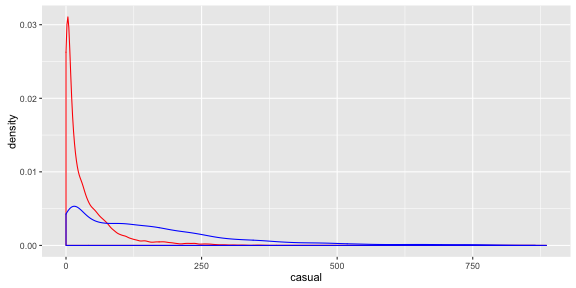
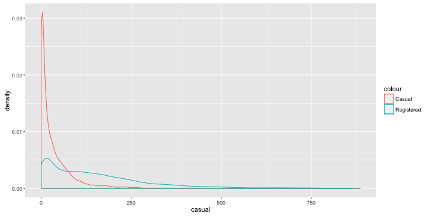
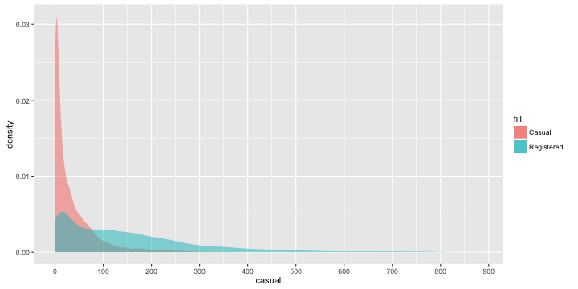
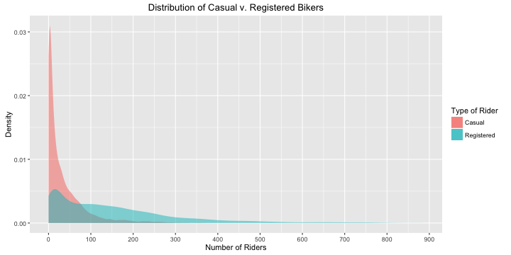
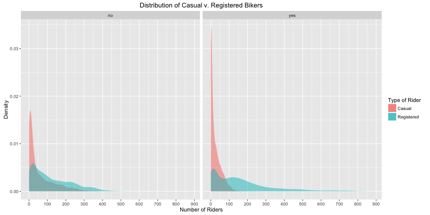

## Components of a plot

* plot object
* aesthetic mapping: connects variables to plotting features such as the x axis, y axis, color, line type, etc.
* layers: consist of a geometry (visual representation) and a statistic (operation on variable)
* scales: allow us to control how an aesthetic is represented in the plot (e.g. specify axis labels (name), axis limits, transformations, colors, line types, etc.)
* themes: allows us to control non-data aspects of the graphic such as font size, location of legend, background colors, etc.

---

## Starting a plot

* `ggplot()` initializes the plot object. It can be used to declare the dataset (must be in the form of a data frame), as well as to specify the set of aesthetics to use for the plot.
* Note: The dataset and aesthetics you specify in `ggplot()` must be common throughout all layers of your plot.

---

## Example

In HW2, we want to compare the distributions of casual and registered bike riders. We will do this today by superposing two density plots (Don't do this in your homework)

We start by examining the dataset: 


```
##   instant     dteday season yr mnth hr holiday weekday workingday
## 1       1 2011-01-01      1  0    1  0       0       6         no
## 2       2 2011-01-01      1  0    1  1       0       6         no
## 3       3 2011-01-01      1  0    1  2       0       6         no
## 4       4 2011-01-01      1  0    1  3       0       6         no
## 5       5 2011-01-01      1  0    1  4       0       6         no
## 6       6 2011-01-01      1  0    1  5       0       6         no
##   weathersit temp  atemp  hum windspeed casual registered cnt
## 1          1 0.24 0.2879 0.81    0.0000      3         13  16
## 2          1 0.22 0.2727 0.80    0.0000      8         32  40
## 3          1 0.22 0.2727 0.80    0.0000      5         27  32
## 4          1 0.24 0.2879 0.75    0.0000      3         10  13
## 5          1 0.24 0.2879 0.75    0.0000      0          1   1
## 6          2 0.24 0.2576 0.75    0.0896      0          1   1
##               newDate
## 1 2011-01-01 00:00:00
## 2 2011-01-01 01:00:00
## 3 2011-01-01 02:00:00
## 4 2011-01-01 03:00:00
## 5 2011-01-01 04:00:00
## 6 2011-01-01 05:00:00
```

---

We initialize our graph using the `ggplot()` function.


```r
ggplot(data = bike)
```


---

## Geometries 
Geometries are the shapes and lines representing data in a plot. 

Default Geometries for Statistics:

Graph type   | call               | statistic | default geom
------------ | ------------------ | --------- | --------------
histogram    | geom_histogram     | bin       | bar
smoother     | geom_smooth        | smooth    | line
boxplot      | geom_boxplot       | boxplot   | boxplox
density      | geom_density       | density   | line
freqpoly     | geom_freqpoly      | bin       | line

---

## Aesthetics

Aesthetics are physical qualities of the geometries in the graph.  The most common aesthetics are:

Aesthetic      | Description
-------------- | -------------------------------------------------------------
x              | position along the x-axis
y              | position along the y-axis
color          | color of 1D component (point, line)
fill           | color of 2D component ("insides")
alpha          | opacity (opposite of transparency); takes on values from 0-1
shape          | shape used for points
size           | size of points

---

## What geometry is in this plot and what are its aesthetics?


---

## Example

Recall: We want to compare the densities of casual and registered bikers by superposing two density plots. Let's start by first creating a density plot of casual bikers.


```r
ggplot(data = bike) +
  geom_density(mapping = aes(x = casual))
```


Why did we have to specify the `x` aesthetic in the `geom_density()` function and not in the main `ggplot()` function?

---

## Multiple layers

We can add on multiple layers with `+`.  If we don't specify aesthetics, then the layer inherits those values in order from the main ggplot call.


```r
ggplot(data = bike) +
  geom_density(mapping = aes(x = casual)) +
  geom_density(mapping = aes(x = registered))
```


---

## Fixed Aesthetics 

We usually think of aesthetics as being mapped from variables.  However, when customizing our graphics, it's often desirable to specify fixed aesthetics.  Below, `x` and `y` are being mapped from variables whereas `color` is treated as a __fixed aesthetic__.  Therefore, we specify it outside the `aes` call.


```r
ggplot(data = bike) +
  geom_density(mapping = aes(x = casual), color = "red") +
  geom_density(mapping = aes(x = registered), color = "blue")
```



What's wrong with this plot?

---

Note: By specifying `color` inside of our `aes()` call, R will automatically assign our geometry a default color. We can specify how we want the label for that color to appear in the legend using `color`


```r
ggplot(data = bike) +
  geom_density(mapping = aes(x = casual, color = "Casual")) +
  geom_density(mapping = aes(x = registered, color = "Registered"))
```



---

We can now change the fill, color, and alpha aesthetics to make our graph look nicer.


```r
plot <- ggplot(bike) + 
  geom_density(mapping = aes(x = casual, fill = "Casual"),
               alpha = 0.5, color = NA) +
  geom_density(mapping = aes(x = registered, fill = "Registered"),
               alpha = 0.5, color = NA) 
plot
```


---

## Scaling

Suppose we wanted our x-axis to range from 0-1000 but we wanted tick marks at intervals of 100 instead of 250. We can use `scale_x_coninuous()` to fix this.


```r
plot2 <- plot + scale_x_continuous(breaks = seq(0, 1000, by = 100))
plot2
```



---

Finally, let's add some labels to our graph.


```r
finalplot <- plot2 + labs(x = "Number of Riders",
                          y = "Density", 
                          title = "Distribution of Casual v. Registered Bikers",
                          fill = "Type of Rider") 
finalplot
```



---

## Faceting

Facets refer to different sides of an object.  When graphing, facetting refers to splitting your data up into subsets and then making multiple graphs from those data.  There are two faceting calls:

* `facet_wrap(~x)` facets the `x` variable, wrapping the panels to make sure they all fit in the frame
* `facet_grid(x~y)` facets the `x` and `y` variable, gridding them so that the `x` values form the rows and `y` values form the columns
* Facetting only works with categorical (factor) variables

---

## facet_wrap

Suppose we wanted to facet the `workingday` variable.


```r
finalplot + facet_wrap( ~workingday)
```


